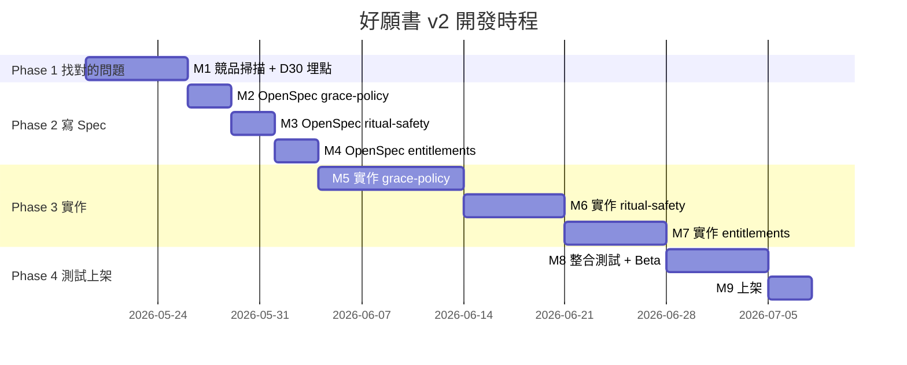

> 以「好願書 v2」為例，拆解一條 PM × AI 真正能跑通的 Agentic Workflow

## 0. AI Native PM 是什麼？

過去兩年最常聽到的職涯焦慮，第一名是「AI 會不會取代 PM」。我的觀察是反過來——**會用 AI 重新組裝工作流的 PM，正在取代不會用的那群**。這就是「AI Native PM」這個詞最近開始浮上來的原因。

它跟「會用 ChatGPT 寫 PRD」不一樣。AI Native PM 的核心是：

- **每個工作節點都重新設計過**：從 source curation、市場研究、寫 MRD / PRD、拆 issue、出 prototype、UIUX 校稿、測試、文件同步——每一段都有對應的 AI 工具，而不是「把舊流程的某一步用 AI 加速」
- **把 AI 當 Agent 用，不是當搜尋引擎**：你給它「挑戰者」角色，它會反問你、挑戰你的假設；你請它「列出 N 種實作路線並標 trade-off」，它會幫你發散方案；這些是 sub-agent 在跑，不是聊天
- **PM 的時間從「執行」回到「判斷」**：以前 PM 80% 時間在生產文件、追進度、轉譯需求，現在這些事 Agent 跑完，PM 真正要做的是**邊界、優先級、判讀**——也就是只有人能做的事

這篇文章以我自己做的「好願書 v2」（一款心經念誦 App）為例，把 Agentic Workflow 跑一遍。**但關鍵點不是哪個 skill 怎麼用，而是「我修正了 AI 哪些事」**——那一章在第 5 節，可以直接跳去看。

<!-- more -->

## 1. 起點：v1 痛點與 N=1 問題

「好願書」是一款做給自己的 app。我每天念心經，但常常忘記今天念到第幾遍、上個月有沒有持續。市面上的念佛計數器要嘛太醜（90 年代 UI）、要嘛太複雜（綁帳號、社群、廣告），所以我做了 v1。

v1 解決的核心痛點很單純：

- **念誦計數**：±1 按鈕 + 木魚音效
- **發願計劃**：可以設定「為家人念 108 遍 × 49 天」這種有目標的修行
- **本地持久化**：AsyncStorage，重開 app 進度不掉
- **禪意 UI**：宣紙米色調、Noto Serif TC、無廣告

技術棧很乾淨：Expo SDK 54、React Native、TypeScript、Zustand。9 個畫面，全部本地優先。

問題是——**v1 解了我的痛點，但這只代表 N=1**。要長到 v2，PM 工作正式開始。

下面是我的完整 v2 流程，分四個 Phase。先來看看整個流程長什麼樣子：


**Phase 2 是這條 flow 的心臟**——同時也是這篇文章值得讀完的章節。其他 Phase 工具換掉還能跑，Phase 2 的人工判斷無法外包。

---

# Phase 1 · 找對的問題

## 2. Step 1：Claude 做 source curation（不是 NotebookLM）

PM 第一個會犯的錯，是憑感覺加功能。「啊我覺得應該加一個共修圈」——這是 founder mode，不是 PM mode。

但 PM 第二個會犯的錯，是**直接把一堆隨便 google 來的 source 丟進 NotebookLM**。差別長這樣：


NotebookLM 是個極強的「閱讀並引用」工具，但它不會幫你判斷哪份 source 值得讀。如果你丟 20 篇文章進去，其中 5 篇是內容農場、3 篇過時、2 篇主題不相關，NotebookLM 還是會誠懇地引用它們，給你看似嚴謹的結論。**Garbage in, citation out。**

所以我在 NotebookLM 之前，加了一層 Claude 做 source curation。

**我給 Claude 的 brief（簡化版）：**

> 我要做「好願書」app 的 v2 規劃，本地優先、不收集、佛教念誦記錄。
> 幫我找：
> 1. 全球與華語圈靈性健康 / mindfulness app 市場規模、CAGR、變現趨勢
> 2. 競品（佛號計數器、Insight Timer、Calm、Headspace、Habit Tracker 類）的功能與評論
> 3. 行為心理學中關於「習慣中斷後放棄」「streak 設計」的研究與評論文章
> 4. 「混合神聖」「數位儀式」相關的近期討論
>
> 每筆給：標題、URL、來源類型（學術 / 產業報告 / 評論 / App Store 頁面）、為什麼這份值得讀。

**Claude 給出的初版有 35 筆**。我自己過濾掉：
- 兩篇看起來像 SEO content farm 的「靈性 app 推薦清單」
- 三篇 2019 年以前的舊報告（市場規模數據已過時）
- 一篇關於「冥想 vs. 正念差別」的純哲學文章（跟 v2 決策無關）

最後留下 27 筆餵進 NotebookLM。

### 為什麼是「Claude 找 → 人篩 → NotebookLM 讀」三段而不是兩段？

| 階段 | 該不該丟 AI | 為什麼 |
|---|---|---|
| 找 source | ✅ 給 Claude | 它能跑 WebSearch、能讀標題判斷主題 |
| 篩 source | ❌ 必須人做 | 哪些「看起來相關但其實沒用」只有 PM 知道 |
| 讀 source | ✅ 給 NotebookLM | 它能讀完所有內容並 cite 原文 |

**這一段如果沒有過濾，會讓總結出來的資訊失真**——NotebookLM 會誠懇地引用爛 source、過時數據、跟你主題無關的文章，給你看起來很嚴謹的結論。過濾的權責只能在 PM 身上。

## 3. Step 2：NotebookLM 跑「挑戰者」prompt

source curate 完，接著進 NotebookLM。**但 prompt 設計才是這一步真正的 PM 工作**。

一般人寫的 prompt：

> 請幫我分析這些 source，整理出 v2 該做什麼。

這種 prompt 的問題是——NotebookLM 會很努力幫你**同意**：「根據 source A，建議加同步功能；根據 source B，建議加社群功能；根據 source C……」 你會得到一份看起來完整、但其實在偷懶的報告。


**我用的 prompt 是反過來的——設成「挑戰者」角色**：

```
你是一位嚴謹的市場研究分析師，正在審閱一份關於 iOS App「好願書」
（念誦修行記錄 App）的市場分析報告。

我已上傳兩類 sources：
1. 一份既有的市場分析報告（標題含「好願書 · 市場需求分析報告」）
2. 8 個競品 App Store 頁面與 4 篇評測文章

你的角色

不是支持者，是挑戰者。你的工作不是同意這份報告，
而是用 sources 中的證據去：

- 驗證它哪些結論站得住腳（並指出證據在哪份 source 的哪一段）
- 反駁它哪些結論證據薄弱或可能錯誤
- 補強它遺漏的視角、競品或痛點

回答原則

- 所有結論必須引用具體 source（NotebookLM 會自動標註）
- 若 sources 中沒有證據，明確說「sources 中查無相關資料」，
  不要靠你自己的訓練資料補答
- 用繁體中文回覆
- 結構化輸出：先給結論，再列證據

開始任務

請先用一段「整體評估」回覆我：這份報告整體可信度多少（高／中／低）？
最強的論點是哪三個？最弱的論點是哪三個？你會建議補哪三類 sources？

完成這段整體評估後，我會逐一深入提問。
```

設計這個 prompt 我反覆改了五次，每次都在強化一件事：**逼 AI 不准用訓練資料補答**。

### 為什麼這樣設計

| 設計選擇 | 為什麼 |
|---|---|
| 「挑戰者，不是支持者」 | 默認狀態下 LLM 太喜歡同意。明示反方角色才會抓到弱點 |
| 「sources 中查無相關資料」就要明說 | 防止它用訓練資料偷渡 |
| 「先給整體評估」 | 強迫先給意見，後面再深入；避免它寫一萬字總結 |
| 「結論引用 source 段落」 | NotebookLM 的核心優勢——逼它用 |
| 「最強/最弱各三個」 | 量化的請求迫使排序，輸出從「並列清單」變成「有優先順序的判斷」 |

跑完一輪，NotebookLM 給的兩個結論直接決定了 v2 方向：

**結論一**：全球靈性健康 app 市場 2025 年 23.8–25.6 億美元、CAGR 14.2–16.6%，但已出現「subscription fatigue」。**買斷或 B2B 才是出路。**

**結論二**：依賴 streak 連續打卡會觸發「what-the-hell effect」，**錯過一天就放棄的機率高 63%**（《Journal of Personality and Social Psychology》2020）。佛號計數器類 app 之所以市佔極高（2,364 則評論、4.8 星），關鍵是「**儀式安全性 > UI/UX 慣例**」——刻意不放「減少」「清除」鍵，防誤觸破壞累積。

這兩個結論看起來樸實，但它們各自殺死了 v2 的兩條死胡同：訂閱制、streak gamification。

---

# Phase 2 · 寫出可執行的文件

## 4. Step 3：Claude Code 生 MRD + PRD

研究結論手上有了，下一步**不是直接跳去寫 code**，也不是去 Obsidian 倒腦袋——而是先生 MRD 與 PRD。

這一步生成 PM 工作流程必備的兩份文件，讓 v2 的市場定位、目標 KPI、scope 邊界在進工程之前就有共識。它們在整條 workflow 的位置是這樣：


### 為什麼分 MRD 與 PRD 兩份

| 文件 | 回答什麼問題 | 給誰看 |
|---|---|---|
| **MRD**（Market Requirements Document） | 我們要解決誰的、什麼問題？市場機會在哪？KPI 是什麼？ | 商業層、未來投資人、自己回顧 |
| **PRD**（Product Requirements Document） | 為了那個 MRD，產品具體做什麼？user story、AC、scope、里程碑 | 工程、設計、QA |

很多人把兩件事混在一份「需求文件」裡——商業假設和驗收條件夾雜，讀 PRD 的工程師看不懂為什麼這條 user story 重要，讀 MRD 的商業人士被技術細節淹沒。

**分開後最大的好處**：MRD 改動觸發策略討論，PRD 改動觸發工程估時。兩種討論不互相干擾。

### MRD 的章節結構（內部開發參考用）

```
1. 文件目的
1.1 術語定義
2. 市場機會（全球 / 台灣 / 後續外推）
3. 目標使用者（3 個 Persona）
4. 關鍵市場洞察（4 條）
5. 競品分析
6. 商業定位
7. v2 商業目標與北極星指標
8. 風險與假設（待驗證假設）
9. 已決議事項紀錄
附錄：資料來源清單
```

### PRD 的章節結構

```
1. 文件目的
1.1 術語定義（與 MRD 同步）
2. v2 願景
3. v2 範圍（in / out scope）
4. 使用者故事與需求（每個 US 含 As / I want / So that / AC）
5. 非功能需求（效能 / 隱私 / 相容性 / i18n / 無障礙）
6. 成功指標（PRD 驗收）
7. 建議里程碑
8. 風險與依賴
9. 開放問題（已決議 / 待決議）
附錄 A：D30 量測方法比較
```

### 怎麼讓 Claude Code 生這兩份

我在 `Claude Code` 跑這條指令（簡化版）：

> 根據以下兩個研究結論（貼上 NotebookLM 的輸出），結合 `README.md` 與 `openspec/specs/` 既有 v1 規格，幫我生成：
>
> 1. 一份 MRD（市場需求文件），章節如下：[…]
> 2. 一份 PRD（產品需求文件），章節如下：[…]
>
> 對話中先跟我確認三個關鍵分歧（變現範圍、寬限機制深度、儀式安全性程度），再開始寫。寫完後幫我同步到 Notion 的「好願書 App Spec」hub 頁底下。

關鍵字是「**對話中先跟我確認三個關鍵分歧**」——這個指令讓 Claude 不會直接生一份你不買單的文件，而是先用 `AskUserQuestion` 跟你來回確認 scope。我把每個分歧的選項放在文章末尾的截圖。

最後產出兩份 Notion 文件、加起來約 5,000 字、含 12 個表格。

**但這份文件其實只有 80% 對。** 剩下 20% 是 Step 4 我修正的事——也是這整篇文章最重要的一節。

## 5. Step 4：人機對照——我修正了 AI 哪些事

> 這一節是這篇文章的核心。如果你看到這邊覺得時間不夠，跳其他章節都行，這節要看完。

**AI 不會主動承認它不知道的事。** 它會用流暢的語氣寫一份看起來完整的文件，但裡面藏著事實錯誤、概念混淆、placeholder 偽裝成結論。PM 的價值就在這 20%——把它們找出來、追問、修正。

下面是我跟 Claude 在生 MRD/PRD 過程中，**真實發生**的 5 個修正案例。

### 修正案例總覽

| # | AI 一開始寫的 | 我問的問題 | 修正後 | PM 思維 |
|---|---|---|---|---|
| 1 | 「**移除 streak** 後 D30 留存提升」 | 「我 v1 真的有 streak 嗎？」 | v1 從來沒有 streak、定位本就正確；v2 是「補上」寬限機制 | 事實核對 |
| 2 | 「63% 放棄率（NotebookLM 研究結論）」 | 「63% 的依據是什麼？」 | 補上《MindSpaceX》文章 + JPSP 2020 期刊 | 來源管理 |
| 3 | 「中斷後 30 天放棄」這個詞混用 | 「中斷是 30 天沒用嗎？」 | 補上術語表：中斷 = 漏 1 天、放棄 = D30 沒回 | 語義精確 |
| 4 | 「D30 量測解法 B：自建匿名聚合 endpoint」用業界術語講 | 「使用者沒上傳資料，怎麼知道他在 D30 回來？」 | 補完整場景拆解、區分「不上傳修行資料」vs.「上傳最小事件」 | 要求白話可解釋 |
| 5 | 資料來源全部寫「NotebookLM 研究結論」 | 「這樣放是要出去查證嗎？」 | 補上 4 個具體來源、Notion 連結、查證路徑 | 文件可用性 |

下面挑三個最有教育意義的案例展開（**順序按故事完整度排，不嚴格對應上表編號**）。

### 案例 1：「v1 真的有 streak 嗎？」

**AI 寫的**：
> 假設 1：**移除 streak** 後，使用者長期留存提升

**你問**：「我 v1 有 streak 嗎？」

**真相**：`grep -rn "streak" src/` 一個字都沒有。v1 從來沒做 streak、v2 也不會做——沒東西可移除，這個假設根本邏輯錯誤。

**修正**：整條改寫成「v2 新增的寬限機制（暫停、兩天法則、自動延期）能挽回中斷後本來會放棄的使用者，提升 D30 留存」。原本那條直接砍掉。

**PM 思維**：AI 流暢的句子最容易繞過事實核對。一句 `grep` 就能驗證的事，只有 PM 會去問——因為他真的關心「我們到底改了什麼」。

### 案例 2：「63% 是哪來的？」

**AI 寫的**：
> 63% 放棄率，出處：NotebookLM 研究結論

**你問**：「63% 的依據是什麼？」

**真相**：AI（我）也不知道，是你給的研究結論轉述。然後你做了最 PM 的動作——回 NotebookLM 翻 source，挖出原始來源：《How to Recover from Habit Streaks Breaking》（MindSpaceX）引述《Journal of Personality and Social Psychology》2020 年研究。

**修正**：MRD §1.1 出處欄改成具體期刊；新增「附錄：資料來源清單」表格。整份文件的引用從「NotebookLM 研究結論」全部改成具體來源，未來查證有路。

**PM 思維**：`TODO: 補上來源` 是文件最常見的腐爛點，三個月後沒人記得補。好 PM 在 TODO 還新鮮時就追到底。

### 案例 3：「中斷是 30 天沒用嗎？」

**AI 寫的**：
> 直接驗證寬限機制是否真的解決研究指出的 63% 放棄率（中斷後的放棄行為）。

**你問**：「中斷是 30 天沒用嗎？」

**真相**：「中斷」這個詞 AI（我）用得很模糊。研究原文的「中斷」是「漏 1 天」就觸發 what-the-hell effect；但 v2 工程上「放棄」的操作定義是「30 天沒開過 app」。**兩個尺度完全不同**，但我都用「中斷」一個詞帶過——讀者根本分不清是漏 1 天還是 30 天沒回。

**修正**：MRD 與 PRD 同步新增「§1.1 術語定義」表，明確區分四個詞：
- **中斷**（錯過）：以「日」為單位，未達當日目標即中斷一天
- **連續中斷**：連續 N 個日曆日皆無 +1 紀錄
- **放棄**（流失）：自最後一次開啟 app 起 ≥ 30 天無使用紀錄
- **D30 retention**：安裝後第 30 天當日仍開啟過 app 的比例

**PM 思維**：模糊的詞最容易在文件中橫行——每個讀者各自填補定義，等驗收 KPI 時才發現大家想的不是同一件事。好 PM 看到一個詞跨章節出現，就會問一句「這幾處講的是同一件事嗎？」

### 80/20 法則

跑完五次修正後，整理出一個觀察：

> **AI 生的 PRD/MRD 約有 80% 對。剩下 20% 包含：事實錯誤、placeholder 偽裝結論、概念混淆、來源缺漏、術語混用。**
>
> 那 20% 就是 PM 在這條 workflow 上的價值。如果 PM 只是按下「生成」就 commit，那 AI 確實可以取代他；如果 PM 會修那 20%，那 AI 永遠是他的放大器。


那 20% 不會自己浮出來——它要 PM 主動問「v1 真的有 streak 嗎？」「63% 是哪來的？」「中斷是 30 天沒用嗎？」才會被發現。

這節之所以放在文章最中間，是因為**它定義了「AI Native PM」與「AI 操作員」的差別**。前者跑完五輪修正才交付文件，後者交付的是 80 分但有事實錯誤的文件。

---

# Phase 3 · 落地到工程

## 6. Step 5：PRD → 工程交付（甘特圖 + Issue 雙軌）

PRD 寫好了，下一步要把它餵給「兩種讀者」：

- **Stakeholder / 自己**：要看整體時程、知道什麼時候能上架 → 用**甘特圖**
- **工程（自己 + Claude Code）**：要看每個 task 該做什麼、AC 是什麼 → 用 **Issue 拆解**

這兩個產出**不互相替代**，它們服務不同對象、解不同問題。我看過很多 PM 文章二選一，但實務上是兩條軌並行。

### 甘特圖：交代時程的視角

PRD §7 已有里程碑表（M1–M9），但表格不夠直觀。我用 Claude 把它轉成 Mermaid Gantt：



甘特圖的角色是**讓非工程的人（自己、stakeholder、未來合作方）一眼看到全局**：8 週能不能上架、哪幾週是關鍵路徑、哪段時間沒安排測試。看里程碑表要逐項加總，看甘特圖一眼就懂。

但 **甘特圖不是工程交付物**——工程師不會對著甘特圖 commit code，他要的是 issue。

### Issue 拆解：給工程接需求的視角

Claude 的真正力氣花在這一步：**把 PRD §4 的每個 user story，拆成可以直接貼進 GitHub Issues / Linear 的格式**。

以 PRD US-G1（暫停請假）為例，Claude 拆出的 issue：

```markdown
## Title
feat(plan): 計劃暫停請假機制

## 背景
PRD §4.1 US-G1。為避免使用者因生病 / 出差中斷後放棄整個計劃，
新增「靜養 / 暫停」按鈕，暫停期間不計入錯過、不觸發提醒通知。

## AC 驗收條件
- [ ] 計劃詳情頁有「靜養 / 暫停」按鈕
- [ ] 暫停可設定 1–14 天或「不指定（手動恢復）」
- [ ] 暫停期間首頁卡片顯示「靜養中 · 剩 N 天」標籤
- [ ] 暫停期間不計入錯過、不觸發提醒通知
- [ ] 暫停結束自動恢復；手動模式可隨時點「恢復」
- [ ] Plan 資料模型新增 pausedFrom / pausedTo 欄位
- [ ] 既有計劃 migration：pausedFrom = null

## 依賴
無

## 估時
1.5 天

## Labels
capability/grace-policy, priority/P0, area/plan
```

甘特圖一格寫「暫停請假 · 1.5 天」是「**什麼時候做**」的答案，issue 是「**該做什麼**」的答案。兩個都要有。

### Claude Code 同時生兩種產出的指令

```
讀 openspec/specs/plan-management/spec.md 與 Notion PRD §4 + §7，做兩件事：

1. 生 Mermaid Gantt：以 PRD §7 里程碑為基準，產出 8 週開發時程圖，
   存到 docs/v2-gantt.md
2. 為每個 user story 生一份 issue.md 草稿到 docs/issues/，
   每份包含：title、背景（含 PRD 連結）、AC、依賴、估時、labels

不要直接 gh issue create，先讓我 review。
```

最後一句是關鍵：**先讓我 review**。AI 抓得到 80%，剩下 20%（哪個 issue 該合併、哪個該拆、依賴對不對、甘特圖估時是否現實）還是 PM 自己看。

## 7. Step 6：寫死邊界—— openspec change proposal

issue 拆出來之前，我先用 [openspec](https://github.com/Fission-AI/openspec) 把每個 capability 的 spec delta 寫死。

openspec 是輕量規格流程，三段：

```markdown
## Why
v1 完成本地念誦記錄體驗，但使用者中斷後容易完全放棄
（63% 放棄率，《JPSP》2020 研究）。v2 補上寬限機制與儀式安全性，
不擴張產品邊界。

## What Changes
- 新增 `grace-policy` capability：暫停請假、兩天法則、自動延期
- 修改 `woodfish-counter`：-1 改為長按、沉浸模式移除 -1、層次 haptic
- 修改 `settings`：清除資料改為 typing confirmation
- 新增 `entitlements` capability：feature flag 抽象層（v2 不接金流）

## Out of scope
- 訂閱制、真實 IAP、paywall
- 雲端同步、帳號系統（含 iCloud，留 v3）
- 社交、streak、AI 解經、B2B
```

**Out of scope 比 What Changes 更重要**。它是 PM 對工程師、設計師、未來的自己劃下的邊界。少了這段，三個月後一定有人問「欸要不要順便加個分享按鈕」。

寫 spec 本身可以丟給 Claude 起草，但 **Out of scope 必須人寫**——AI 不知道哪些東西碰了會死。

## 8. Step 7：Claude Code 跑 Prototype + Code Review

spec 寫死了，最後一段才是工程師的活——而工程師可以是 Claude Code。

openspec 的好處是它強迫你寫 `tasks.md`。Claude Code 拿到 `proposal.md + design.md + tasks.md`，可以**逐項勾選任務直接寫 code**。它不會憑空發明 API、不會亂改既有 store 結構，因為它要對著 spec 跑。

我這邊做兩件事：**code review** 與 **對 spec 校稿**。

**Code review**：每寫完一個 task block 就 commit，commit message 引用 task 編號（`feat(grace): 1.1 add pausedFrom/pausedTo to Plan`）。

**對 spec 校稿**：第一版幾乎一定不對 spec —— AI 會試圖「優化」你的設計（加 toggle、加進度條、加「立即同步」按鈕），每個都看起來貼心、每個都是 scope creep。我會逐項對 PRD AC：

- ✅ 暫停可設定 1–14 天 → 有
- ✅ 「靜養中 · 剩 N 天」標籤 → 有
- ❌ AI 多加了「強制結束暫停」紅色按鈕 → spec 沒寫、跟「靜養」氣質衝突，砍掉
- ❌ AI 把標籤色用 `#FF6B6B` 警示橘 → 全 app 用低飽和色，要改成 token `colors.zen.moss`

**AI 給的畫面對的 spec 有 80% 準。剩下 20% 是它沒看見的全局約束**（既有 utils、既有設計語言慣例、產品調性）。這 20% 是 PM 在守的東西。

## 9. Step 8：Playwright 自主測試

UIUX 對齊完，下一步是**讓 Claude Code 自己驗收**。

Playwright 在這套 workflow 的角色不是「QA 工程師寫的 E2E 測試」，而是**讓 Agent 有眼睛**——Claude Code 自己跑流程、自己截圖、自己對著預期行為比對，發現問題自己回去改。

我給 Claude Code 的指令：

> 跑 PRD §4.1 US-G1（暫停請假）的驗收。
>
> 1. 啟動 simulator
> 2. 用 Playwright 走完「進入計劃 → 點暫停 → 設定 3 天 → 確認 → 回首頁看標籤」flow
> 3. 每一步截圖到 `screenshots/grace-pause/`
> 4. 對照 PRD AC 逐項打勾，標出差異
> 5. 如果有差異，回去改 code 再跑一次

關鍵是「**可插入在任一環節**」——你不一定要等所有 task 都做完才測。每完成一個 user story 就跑一輪 Playwright，AI 自己找到問題自己改，省下大量 simulator 手動點擊的時間。

## 12. Step 11：Figma / Pencil 設計稿往返（選擇性）

如果你有設計師、或想要把 prototype 帶回設計工具精修，可以接 **Figma** 或 **Pencil**。

**Figma vs. Pencil 簡比：**

| 維度 | Figma | Pencil |
|---|---|---|
| **AI 整合方式** | Plugin 路線 | 原生 MCP server |
| **檔案儲存** | 雲端為主 | 加密的 `.pen` 檔案存本地 |
| **協作模式** | 多人即時編輯，業界標準 | 個人為主 |
| **AI 操作精度** | 需透過 plugin 翻譯 node | Claude Code 直接 read/edit/snapshot |
| **適合場景** | 團隊有設計師、需要設計交付 | 個人 + Agent 工作流、隱私敏感專案 |

對好願書這種「**一個人 + AI Agent + 本地優先**」的專案，我選 Pencil——Claude Code 不用任何 plugin 就能直接讀寫 `.pen` 檔案，整條鏈路不離開 agentic context。

這一節是**選擇性的**——好願書 v2 多數 screen 直接讓 Claude Code 用 Pencil MCP 跑完就收工；只有「新功能首頁」這種視覺份量重的 screen 才丟進 Pencil 微調比例。

---

# Phase 4 · 同步給人

## 11. Step 10：Notion 同步給人

最後一步：把 MRD、PRD、決策紀錄、設計稿全部丟到 Notion。

我不會把整份 markdown 複製貼上——那等於把開發中倉作為單一資訊源的優勢丟掉。我做的是：

- **Notion 上放結論性文件**：MRD、PRD、已決議事項
- **連結回 GitHub**：`openspec/changes/2026-05-19-grace-policy/` 是 single source of truth
- **設計稿、截圖、決策紀錄**放 Notion，因為這些東西進 git 太重
- **資料來源**標明：能連到 Notion 內部頁的直接 link，外部 NotebookLM source 標明查證路徑

Notion 是給「不寫 code 的人」看的視窗。git repo 是給「會 checkout 的人」用的依據。

Claude Code 配合 Notion MCP，從 PRD 直接同步到 Notion 頁面是一鍵——但**「哪些放、哪些不放」這個決定永遠是人做的**。我會選擇性地把 MRD/PRD 同步上去，但 OpenSpec change proposal 留在 git。

---

## 人機協作的三層分工

在跳進總表前，先把這套 workflow 的「人機分工」抽象成三層：


**愈往上愈無法外包**。第 5 節那 5 個修正案例之所以重要，是因為它們同時跨在 L2（校稿）跟 L3（判斷）——L1 的 AI 完全沒能力觸及。

## 總結：哪些 AI 做、哪些必須是人做

| 流程節點 | 工具 / Skill | 能丟 AI | 不能丟 AI |
|---|---|---|---|
| **Source curation** | Claude WebSearch | ✅ 跑搜尋、列候選、給來源類型 | ❌ 哪些 source 不該餵 NotebookLM |
| **市場研究** | NotebookLM | ✅ 讀完所有 source、cite 原文、跑挑戰者 prompt | ❌ 設計挑戰者 prompt、判讀結論可信度 |
| **生 MRD / PRD** | Claude Code | ✅ 起草章節、結構化輸出、同步到 Notion | ❌ scope 邊界、KPI 選擇、術語精確性 |
| **人機對照修正** | 人腦 + 一杯咖啡 | — | ❌ **全部**。事實核對、來源追問、概念拆解 |
| **PRD → Issue** | Claude Code | ✅ 把 user story 拆成 issue 格式 + AC | ❌ 哪些該合併、依賴怎麼定 |
| **甘特圖** | Mermaid | ✅ 從里程碑表轉成視覺化時程 | ❌ 估時是否現實、stakeholder 想看哪個切角 |
| **寫死邊界** | openspec | ✅ 起草 Why / What | ❌ **Out of scope**。AI 不知道哪些碰了會死 |
| **寫 Code** | Claude Code | ✅ 對著 tasks.md 逐項實作、commit | ❌ Code review、確認沒越界 |
| **自主測試** | Playwright + Claude | ✅ 跑 flow、截圖、對照、自己改 | ❌ 決定要測什麼 flow、什麼算過關 |
| **設計稿往返** | Figma / Pencil | ✅ 視覺微調、Design System 套用 | ❌ 「該不該往返」這個選擇 |
| **同步 Notion** | Claude + Notion MCP | ✅ 格式轉換、產截圖 | ❌ 哪些資訊放哪裡、誰能看 |

---

## 結語：AI Native PM 的真正定義

寫完這篇文章我重新校正了一次自己的定義：

> **AI Native PM 不是「每個節點都用 AI」的 PM，是「每個節點都知道 AI 在哪會錯」的 PM。**

第 5 節那 5 個修正案例，是這個定義的證據。如果你只看 AI 跑出來的 MRD/PRD，會以為它寫得很好。但只要你願意問一句「v1 真的有 streak 嗎？」「63% 是哪來的？」「中斷是 30 天沒用嗎？」——AI 的 80% 流暢就會撞上 20% 真相。

那 20% 是 PM 的價值，也是這份工作不會被 AI 取代的核心。

### 為什麼這條 flow 第一步堅持用 NotebookLM？

整篇文章看下來，最前面那一步（Step 1 + Step 2）看起來最簡單也最容易省略——「不就是找資料、跑研究嗎？直接丟給 ChatGPT 不就好了？」

但我堅持用 NotebookLM，不是因為它的介面好看，而是因為它的**設計限制**：

- **它只用你給它的 source**，不會自己用訓練資料補答
- **它的每個結論都會 cite 哪一段**，回頭追溯得到原文
- **它沒看過的東西就會老實說「sources 中查無相關資料」**

換句話說，NotebookLM 是**降低 AI 幻覺風險**的工具，代價是 PM 要先做好 source curation（Step 1）。直接讓單一 LLM 跑「請幫我分析市場」確實快，但你得到的是流暢的訓練資料拼貼，而不是可追溯的研究結論——當這份結論要支撐 MRD 的市場規模、競品數據、心理學引用時，**可追溯性是不可妥協的**。

這個工具選擇的邏輯，跟整篇文章想講的主軸是一致的：**好 PM 不是用最強的 AI，而是用對的 AI、並且承擔 AI 限制反映出來的責任**。

### 一句話收尾

工具讓你跑得更快，**但跑去哪裡、什麼時候該停下來反問、哪些事不該假設「AI 應該知道」——這些事還是只有人能做**。

---

## 附錄：好願書 v2 文件位置

- MRD: [Notion 頁面](https://www.notion.so/364fac1cd710814cb08ec2fa9b431196)
- PRD: [Notion 頁面](https://www.notion.so/364fac1cd71081efafb1f6f9db25cf0a)
- 市場需求分析報告: [Notion](https://www.notion.so/362fac1cd7108134bd8ee70f50fca4a7)
