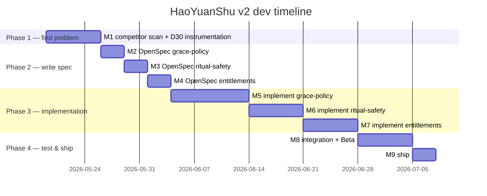

> Using HaoYuanShu v2 as the case study, this post walks through a PM × AI workflow that actually runs end-to-end.

## 0. What is an AI Native PM?

The most common career anxiety I've heard the past two years is "is AI going to replace PMs?" My read is the opposite — **PMs who rewire their workflow around AI are replacing the ones who don't**. That's why the phrase "AI Native PM" has been bubbling up.

It's a different thing from "a PM who uses ChatGPT to write PRDs." The core of AI Native PM is:

- **Every node in the workflow is redesigned**: source curation, market research, MRD / PRD, issue slicing, prototype, UIUX review, testing, doc sync — every segment has a dedicated AI tool, not just "the old flow with one step accelerated by AI".
- **AI is used as an Agent, not a search engine**: cast it as a "challenger" and it interrogates your assumptions; ask it to "list N implementation paths with trade-offs" and it diverges options for you. These are sub-agents at work, not chat.
- **PM time shifts from "execute" back to "judge"**: PMs used to spend 80% of their time producing documents, chasing progress, translating requirements. With agents handling that, the PM's real work is **boundary, priority, judgment** — the parts only a human can do.

This post uses my own project HaoYuanShu v2 (a Heart Sutra recitation app) as the running example to walk the full Agentic Workflow once. **But the point isn't which skill does what — it's "the things I had to correct the AI on"**. That chapter is Section 5, and you can jump straight to it.

<!-- more -->

## 1. Origin: v1 pain points and the N=1 problem

HaoYuanShu started as an app I built for myself. I recite the Heart Sutra daily, but I kept forgetting how many times I'd chanted that day, or whether I'd kept it up last month. The Buddhist counters in the App Store were either visually stuck in the 90s or bolted onto account systems, social features, and ads I didn't want. So I built v1.

v1 solves a very narrow set of pain points:

- **Recitation counting**: ±1 buttons + wooden fish sound effect
- **Vow plans**: e.g. "recite 108 times × 49 days dedicated to family"
- **Local persistence**: AsyncStorage — progress survives app restarts
- **Zen UI**: rice-paper beige, Noto Serif TC, no ads

Tech stack is clean: Expo SDK 54, React Native, TypeScript, Zustand. Nine screens, fully local-first.

The problem is — **v1 solved my pain point, which is N=1**. To grow into v2, real PM work has to begin.

Here's the full v2 workflow, in four phases. Let's start with the overview:


**Phase 2 is the heart of this flow** — and the section of this post worth reading in full. The other phases still work if you swap their tools out; the human judgment in Phase 2 cannot be outsourced.

---

# Phase 1 · Find the right problem

## 2. Step 1: Claude does source curation (not NotebookLM)

The first mistake PMs make is adding features by gut feel. "Oh, we should add a co-practice circle" — that's founder mode, not PM mode.

But the second mistake PMs make is **dumping a pile of randomly googled sources straight into NotebookLM**. The difference looks like this:


NotebookLM is an incredibly strong "read and cite" tool, but it won't tell you which source was worth reading. Drop 20 articles into it where 5 are content-farm SEO, 3 are out of date, and 2 are off-topic, and NotebookLM will dutifully cite all of them and hand you a polished, "rigorous" conclusion. **Garbage in, citation out.**

So before NotebookLM, I add a Claude layer to do source curation.

**The brief I gave Claude (simplified):**

> I'm planning v2 for the HaoYuanShu app — local-first, no data collection, Buddhist recitation tracking.
> Find me:
> 1. Global and Chinese-speaking spiritual wellness / mindfulness app market size, CAGR, monetization trends
> 2. Competitors (佛號計數器, Insight Timer, Calm, Headspace, habit-tracker class) — features and reviews
> 3. Behavioral psychology on "abandonment after streak breaks" and "streak design" — research papers and critique
> 4. Recent discussion of "hybrid sacred" and "digital ritual"
>
> For each: title, URL, source type (academic / industry report / review / App Store page), why this one is worth reading.

**Claude's first pass had 35 entries**. I filtered out:
- Two that looked like SEO content-farm "spiritual app top 10" lists
- Three pre-2019 reports (market size data is now stale)
- One philosophical piece on "meditation vs. mindfulness" (irrelevant to v2 decisions)

Twenty-seven remained, fed into NotebookLM.

### Why "Claude finds → human filters → NotebookLM reads" three stages, not two?

| Stage | Should you give it to AI? | Why |
|---|---|---|
| Find sources | ✅ Give Claude | It can run WebSearch and judge topics from titles |
| Filter sources | ❌ Must be human | Only the PM knows which ones "look relevant but aren't useful" |
| Read sources | ✅ Give NotebookLM | It reads everything and cites the original |

**Skipping the filter is what makes summaries unreliable** — NotebookLM will dutifully cite bad sources, stale numbers, and off-topic articles, and the resulting conclusion will look rigorous on the surface. The filtering responsibility lives only with the PM.

## 3. Step 2: NotebookLM with a "challenger" prompt

After curation, send the sources into NotebookLM. **But prompt design is where the real PM work in this step happens.**

The prompt most people write:

> Please analyze these sources and tell me what v2 should do.

The problem with that prompt — NotebookLM works hard to **agree** with you: "Per source A, add sync. Per source B, add social. Per source C…" You get a thorough-looking, lazy report.


**My prompt is the opposite — it casts NotebookLM as a "challenger":**

```
You are a rigorous market research analyst, reviewing a market analysis report
for the iOS app "HaoYuanShu" (a Buddhist recitation tracking app).

I have uploaded two types of sources:
1. An existing market analysis report (titled "HaoYuanShu · Market Requirements Analysis")
2. 8 competitor App Store pages and 4 review articles

Your role:

You are not a supporter, you are a challenger. Your job is not to agree with this
report — but to use evidence in the sources to:

- Validate which conclusions hold up (and point to which source / section is the evidence)
- Refute which conclusions have weak or flawed evidence
- Reinforce which perspectives, competitors, or pain points are missing

Answering principles:

- Every conclusion must cite a specific source (NotebookLM will auto-label)
- If sources do not contain evidence, explicitly say "no relevant data in sources"
  — do not fall back on your training data
- Respond in Traditional Chinese
- Structured output: conclusion first, then evidence

Begin:

Start with an overall assessment. How credible is this report overall (high / medium / low)?
What are the three strongest arguments? Three weakest? Which three categories of sources
would you suggest adding?

After this overall assessment, I'll go deeper one topic at a time.
```

I revised this prompt five times before shipping, each pass reinforcing one thing: **stop the AI from filling gaps with training data**.

### Why this design

| Design choice | Why |
|---|---|
| "Challenger, not supporter" | LLMs default to agreement. Explicitly assigning the opposing role is what surfaces weakness. |
| "Must say 'no data in sources' when missing" | Blocks training-data smuggling. |
| "Start with an overall assessment" | Forces an opinion up front, then drills in. Prevents a 10,000-word essay. |
| "Conclusions must cite source sections" | Forces use of NotebookLM's core advantage. |
| "Top 3 strongest / weakest" | Quantified asks force ranking. Output turns from "parallel list" into "ordered judgment". |

After one round, NotebookLM returned two conclusions that decided v2's direction:

**Conclusion 1**: The global spiritual wellness app market is USD 2.38–2.56 B in 2025 with 14.2–16.6% CAGR, but **subscription fatigue is now visible**. **One-time purchase or B2B is the way out.**

**Conclusion 2**: Relying on streak counters triggers the "what-the-hell effect" — **a missed day raises full abandonment probability by 63%** (per *Journal of Personality and Social Psychology*, 2020). The reason apps like 佛號計數器 dominate their niche (2,364 reviews, 4.8 stars) is "**ritual safety > UX convention**" — they deliberately omit "minus" and "clear" buttons to prevent accidental erasure.

These two conclusions look plain, but each killed a dead end for v2: subscriptions, and streak gamification.

---

# Phase 2 · Write executable docs

## 4. Step 3: Claude Code produces MRD + PRD

With research conclusions in hand, the next step is **not jumping straight to code**, and not dumping thoughts into Obsidian — it's producing MRD and PRD first.

This step produces the two documents the PM workflow can't skip — the ones that align market positioning, KPI targets, and scope boundaries *before* engineering starts. Here's where they sit in the workflow:


### Why split MRD and PRD into two documents

| Doc | Answers what question? | Who reads it? |
|---|---|---|
| **MRD** (Market Requirements Document) | Whose problem are we solving? Where's the market opportunity? What's the KPI? | Business stakeholders, future investors, future-you |
| **PRD** (Product Requirements Document) | Given that MRD, what does the product specifically do? user story, AC, scope, milestones | Engineering, design, QA |

Many people mash both into one "requirements doc" — business assumptions and acceptance criteria mingle, the engineer reading the PRD can't tell why a user story matters, the business stakeholder reading the MRD drowns in technical detail.

**The biggest benefit of splitting**: MRD changes trigger strategy conversations, PRD changes trigger engineering estimation. The two conversations stop interfering with each other.

### MRD chapter structure (for internal dev reference)

```
1. Document purpose
1.1 Terminology
2. Market opportunity (global / Taiwan / expansion plan)
3. Target users (3 personas)
4. Key market insights (4 items)
5. Competitive analysis
6. Business positioning
7. v2 business goals & north-star metric
8. Risks & assumptions (to-be-validated)
9. Resolved decisions log
Appendix: source list
```

### PRD chapter structure

```
1. Document purpose
1.1 Terminology (synced with MRD)
2. v2 vision
3. v2 scope (in / out)
4. User stories & requirements (each US carries As / I want / So that / AC)
5. Non-functional requirements (perf / privacy / compatibility / i18n / a11y)
6. Success metrics (PRD acceptance)
7. Recommended milestones
8. Risks & dependencies
9. Open questions (resolved / pending)
Appendix A: D30 measurement methods comparison
```

### How to make Claude Code generate both

The command I run in `Claude Code` (simplified):

> Based on the following two research conclusions (paste NotebookLM output), combined with `README.md` and the existing v1 specs under `openspec/specs/`, generate:
>
> 1. An MRD (Market Requirements Document) — chapters as below: […]
> 2. A PRD (Product Requirements Document) — chapters as below: […]
>
> First confirm three key disagreements with me in conversation (monetization scope, grace mechanism depth, ritual safety strictness), then start writing. After done, sync to the Notion "HaoYuanShu App Spec" hub.

The key phrase is "**first confirm three key disagreements with me in conversation**" — this instruction stops Claude from generating a doc you wouldn't buy into. It uses `AskUserQuestion` to walk through scope with you. I'm putting screenshots of each disagreement at the end of the post.

The final output was two Notion docs totaling roughly 5,000 characters and 12 tables.

**But this output is only 80% correct.** The remaining 20% is what I fixed in Step 4 — and that's the most important section of this entire post.

## 5. Step 4: Human-AI cross-check — what I had to correct the AI on

> This section is the core of the post. If you're tight on time, skip anything else, but read this.

**AI won't proactively admit what it doesn't know.** It writes fluent prose that *looks* complete, but hides factual errors, conceptual confusion, and placeholders disguised as conclusions. The PM's value is exactly this 20% — finding them, interrogating them, fixing them.

Here are five **real** correction cases that happened while Claude and I were producing MRD/PRD.

### Correction overview

| # | What AI wrote first | The question I asked | After correction | PM thinking shown |
|---|---|---|---|---|
| 1 | "**Removing streak** would lift D30 retention" | "Did v1 actually have streaks?" | v1 never had streaks — the positioning was already right; v2 only *adds* the grace mechanism | Fact-check |
| 2 | "63% abandonment (NotebookLM research conclusion)" | "What's the basis for 63%?" | Added the MindSpaceX article + the JPSP 2020 journal source | Source management |
| 3 | "Abandon after 30 days of being broken" — term used loosely | "Does 'broken' mean 30 days of no use?" | Added a terminology table: broken = missed 1 day, abandoned = no D30 return | Semantic precision |
| 4 | "D30 measurement Plan B: self-hosted anonymous aggregate endpoint" — explained in industry jargon | "If users don't upload data, how do we know they returned on D30?" | Added full scenario walkthrough, separated "doesn't upload practice data" vs. "uploads minimal event" | Demand plain-language explanation |
| 5 | All citations written as "NotebookLM research conclusion" | "Is this supposed to be looked up externally?" | Added 4 concrete sources, Notion links, citation paths | Document usability |

Below I expand three of the most instructive cases (**ordered by story completeness, not strictly matching the table above**).

### Case 1: "Did v1 actually have streaks?"

**AI wrote**:
> Assumption 1: **Removing streaks** would improve long-term user retention.

**You asked**: "Did v1 actually have streaks?"

**Truth**: `grep -rn "streak" src/` returns zero matches. v1 never implemented streaks, and v2 won't either — there is nothing to remove, so the assumption is logically broken.

**Fix**: Rewrite the entire assumption: "v2's new grace mechanism (pause, two-day rule, auto-extend) reclaims users who would otherwise abandon after a break, lifting D30 retention." The original assumption is deleted.

**PM thinking**: When AI prose flows smoothly, you skip fact-checking. "Did v1 have streaks?" is a question `grep` can answer in seconds, but only the PM will ask — because only the PM actually cares about "what did we actually change?"

### Case 2: "Where did 63% come from?"

**AI wrote**:
> 63% abandonment rate, source: NotebookLM research conclusion

**You asked**: "What's the basis for 63%?"

**Truth**: AI (me) didn't actually know. The number was a paraphrase from the NotebookLM conclusion you gave me. Then you did the most PM-like thing — went back into NotebookLM, dug through the sources, and pulled up the original: *How to Recover from Habit Streaks Breaking* (MindSpaceX), citing *Journal of Personality and Social Psychology* (2020).

**Fix**: Updated MRD §1.1's source column to the specific journal; added a "source list appendix" table. Every citation in the doc that used to say "NotebookLM research conclusion" now points to a concrete source — future readers can verify.

**PM thinking**: `TODO: cite source` is the most common rot point in any doc — three months later, nobody remembers to fill it in. Good PMs chase it down while the TODO is fresh.

### Case 3: "Does 'broken' mean 30 days of no use?"

**AI wrote**:
> Directly validate whether the grace mechanism solves the research's 63% abandonment rate (broken-streak abandonment behavior).

**You asked**: "Does 'broken' mean 30 days of no use?"

**Truth**: I (the AI) had been using "broken" loosely. In the research, "broken" means **missing 1 day** is enough to trigger the what-the-hell effect. In v2 engineering, "abandoned" means **30 days without opening the app**. **Two completely different scales**, but I papered over both with the same word "broken" — readers couldn't tell whether we meant 1 day or 30.

**Fix**: Added a "§1.1 Terminology" table to both MRD and PRD, defining four distinct terms:
- **Broken (missed)**: per day — failing today's target counts as broken for that day
- **Consecutive broken**: N consecutive calendar days with no +1 record
- **Abandoned (churned)**: ≥ 30 days since the last app open
- **D30 retention**: percent of installs that re-open the app on day 30

**PM thinking**: Loose vocabulary runs rampant in documents — every reader fills in their own definition, and the mismatch only surfaces when KPIs need to be accepted. Good PMs notice when one word appears across multiple sections and ask, "are we talking about the same thing in all of these places?"

### The 80/20 rule

After five rounds of correction, an observation crystallized:

> **AI-generated PRD/MRD is about 80% correct. The other 20% contains factual errors, placeholders disguised as conclusions, conceptual confusion, missing citations, and term collisions.**
>
> That 20% is the PM's value in this workflow. If a PM hits "generate" and commits, the AI really does replace them. If the PM fixes the 20%, AI is always an amplifier.


That 20% does not surface on its own — it only emerges when a PM actively asks "did v1 actually have streaks?", "where did 63% come from?", "does 'broken' mean 30 days?".

The reason this section sits in the middle of the post is that **it defines the gap between an "AI Native PM" and an "AI operator"**. The former ships a doc after five rounds of correction; the latter ships an 80-point doc with factual errors.

---

# Phase 3 · Land in engineering

## 6. Step 5: PRD → engineering delivery (Gantt + Issue, dual track)

PRD is done. Next it has to feed "two readers":

- **Stakeholders / yourself**: want to see the full timeline, know when shipping is realistic → **Gantt chart**
- **Engineering (yourself + Claude Code)**: want to see each task, what to do, what the AC is → **Issue breakdown**

These two outputs are **not substitutes** — they serve different audiences and solve different problems. I've seen many PM posts pick one over the other, but in practice the two tracks run in parallel.

### Gantt: the timeline view

PRD §7 already has a milestone table (M1–M9), but tables aren't visual enough. I have Claude convert it into a Mermaid Gantt:



The Gantt's job is **to let non-engineers (myself, stakeholders, future collaborators) see the whole picture at a glance**: can we ship in 8 weeks, which weeks are on the critical path, where is testing under-allocated. Adding milestone rows in your head takes effort; the Gantt is read in a second.

But **the Gantt is not an engineering deliverable** — engineers don't commit code against a Gantt; they need issues.

### Issue breakdown: the engineering-intake view

This is where Claude actually earns its keep: **slicing each user story from PRD §4 into a format you can paste straight into GitHub Issues / Linear**.

Take PRD US-G1 (pause / sick leave). Claude produced this issue:

```markdown
## Title
feat(plan): Plan pause / sick-leave mechanism

## Background
PRD §4.1 US-G1. To prevent users from abandoning an entire plan after
sickness or travel breaks, add a "rest / pause" button. While paused,
breaks don't count, and reminder notifications stop firing.

## AC (acceptance criteria)
- [ ] Plan detail screen has "rest / pause" button
- [ ] Pause can be set 1–14 days or "unspecified (manual resume)"
- [ ] While paused, home card shows "resting · N days left" label
- [ ] While paused, breaks don't count and notifications are suppressed
- [ ] Auto-resume at pause end; manual mode can resume at any time
- [ ] Plan data model adds pausedFrom / pausedTo fields
- [ ] Existing plan migration: pausedFrom = null

## Dependencies
None

## Estimate
1.5 days

## Labels
capability/grace-policy, priority/P0, area/plan
```

A Gantt row says "pause · 1.5 days" — that's "**when to do it**". The issue says "**what to do**". You need both.

### The Claude Code instruction that produces both at once

```
Read openspec/specs/plan-management/spec.md and Notion PRD §4 + §7. Do two things:

1. Produce a Mermaid Gantt: based on PRD §7 milestones, generate an 8-week
   dev timeline, save to docs/v2-gantt.md
2. For each user story, generate an issue.md draft into docs/issues/.
   Each issue includes: title, background (with PRD link), AC,
   dependencies, estimate, labels.

Do NOT run gh issue create — let me review first.
```

That last line matters: **review first**. AI handles 80%, but the other 20% (which issues to merge, which to split, whether dependencies are right, whether the Gantt's estimates are realistic) is still on the PM.

## 7. Step 6: Lock down boundaries — openspec change proposal

Before slicing issues, I write spec deltas for each capability using [openspec](https://github.com/Fission-AI/openspec).

openspec is a lightweight spec process — three sections:

```markdown
## Why
v1 delivered the local recitation tracking experience, but users tend to
abandon entirely once they break a streak (63% abandonment per JPSP 2020).
v2 fills in the grace mechanism and ritual safety — without expanding scope.

## What Changes
- New `grace-policy` capability: pause leave, two-day rule, auto-extend
- Modify `woodfish-counter`: -1 becomes long-press, removed from immersive mode, layered haptics
- Modify `settings`: clear-data becomes typing confirmation
- New `entitlements` capability: feature flag abstraction (v2 does not wire payments)

## Out of scope
- Subscriptions, real IAP, paywalls
- Cloud sync, account systems (including iCloud — defer to v3)
- Social, streak, AI sutra interpretation, B2B
```

**Out of scope matters more than What Changes.** It's the boundary the PM draws for engineers, designers, and future-you. Without it, three months later someone will ask "while we're at it, shall we add a share button?"

The Why and What can be drafted by Claude. **Out of scope must be written by a human** — AI doesn't know which things will explode if touched.

## 8. Step 7: Claude Code prototypes + Code Review

With the spec locked, the last leg is engineering work — and the engineer can be Claude Code.

openspec's advantage is forcing you to write a `tasks.md`. Claude Code, given `proposal.md + design.md + tasks.md`, **walks the task list and ships code item by item**. It won't invent APIs or restructure existing stores arbitrarily, because it's executing against the spec.

My job here is two things: **code review** and **spec alignment**.

**Code review**: I commit after each task block, with the task number in the message (`feat(grace): 1.1 add pausedFrom/pausedTo to Plan`).

**Spec alignment**: the first version almost always drifts. AI tries to "improve" your design — add a toggle, add a progress bar, add a "sync now" button — each looks helpful, each is scope creep. I walk through PRD AC item by item:

- ✅ Pause configurable 1–14 days → present
- ✅ "Resting · N days left" label → present
- ❌ AI added a red "force end pause" button → not in spec, conflicts with the "resting" tone — removed
- ❌ AI used `#FF6B6B` warning orange for the label → the app uses low-saturation tones; changed to token `colors.zen.moss`

**AI gets 80% of the spec right. The other 20% is the global context it doesn't see** — existing utils, established design language, product tone. That 20% is what the PM guards.

## 9. Step 8: Playwright self-tests

After UIUX alignment, the next step is **letting Claude Code accept its own work**.

Playwright's role here isn't "the E2E suite a QA engineer writes" — it's **giving the agent eyes**: Claude Code walks the flow itself, takes its own screenshots, compares against expected behavior, and goes back to fix what it finds.

The command I give Claude Code:

> Accept PRD §4.1 US-G1 (pause leave).
>
> 1. Boot the simulator
> 2. With Playwright, walk through "enter plan → tap pause → set 3 days → confirm → return to home, see label"
> 3. Screenshot every step into `screenshots/grace-pause/`
> 4. Tick off each PRD AC, flag any deltas
> 5. If there are deltas, go back and fix the code, then re-run

The key is "**this can be inserted at any step**" — you don't wait until all tasks are done to run tests. Each completed user story gets a Playwright round; the AI finds its own issues and fixes them, saving you a lot of manual simulator clicking.

## 10. Step 9: Figma / Pencil design round-trip (optional)

If you have a designer — or want to take a prototype back into a design tool for polish — connect **Figma** or **Pencil**.

**Figma vs. Pencil quick comparison:**

| Dimension | Figma | Pencil |
|---|---|---|
| **AI integration** | Plugin route | Native MCP server |
| **File storage** | Cloud-primary | Encrypted `.pen` files, local |
| **Collaboration** | Real-time multi-user, industry standard | Individual-focused |
| **AI operation precision** | Needs plugin to translate nodes | Claude Code reads / edits / snapshots directly |
| **Best for** | Teams with designers, design handoff | Solo + Agent workflow, privacy-sensitive |

For a project like HaoYuanShu — **one person + AI Agent + local-first** — I picked Pencil. Claude Code reads and writes `.pen` files directly with no plugin; the entire chain stays inside the agentic context.

This step is **optional**. For most screens in HaoYuanShu v2, Claude Code with Pencil MCP finishes the job in one pass. Only the visually-heavy "new feature home" screen actually round-trips through Pencil for proportional fine-tuning.

---

# Phase 4 · Sync to humans

## 11. Step 10: Notion sync for the non-coders

Last step: push MRD, PRD, decision logs, and design exports into Notion.

I don't copy-paste the entire markdown — that throws away the advantage of having a dev repo as single source. What I do:

- **Put conclusions on Notion**: MRD, PRD, resolved decisions
- **Link back to GitHub**: `openspec/changes/2026-05-19-grace-policy/` is the single source of truth
- **Designs, screenshots, decision logs go to Notion**, because those things weigh git down
- **Sources are explicit**: Notion internal pages get a direct link; external NotebookLM sources get a citation path

Notion is the window for "people who don't read code". The git repo is the source of truth for "people who can check out". 

Claude Code + Notion MCP makes "PRD → Notion page" a single command — but **deciding what goes where, and who can see it, is always human work**. I selectively sync MRD/PRD up, but keep the OpenSpec change proposal in git.

---

## Three layers of human-AI collaboration

Before the summary table, let's abstract this workflow into three layers:


**The higher up, the less outsourceable.** The five correction cases in Section 5 matter because they straddle L2 (review) and L3 (judgment) — L1 AI cannot touch them at all.

## Summary: which work is for AI, which must be human

| Workflow node | Tool / Skill | Can give AI | Cannot give AI |
|---|---|---|---|
| **Source curation** | Claude WebSearch | ✅ Run search, list candidates, label source type | ❌ Decide which sources don't deserve NotebookLM |
| **Market research** | NotebookLM | ✅ Read all sources, cite original, run challenger prompt | ❌ Design the challenger prompt, judge conclusion credibility |
| **MRD / PRD** | Claude Code | ✅ Draft chapters, structured output, sync to Notion | ❌ Scope boundaries, KPI choice, terminology precision |
| **Human-AI correction** | Brain + coffee | — | ❌ **All of it**. Fact-check, source-chase, concept-split |
| **PRD → Issue** | Claude Code | ✅ Slice user story into issue format + AC | ❌ Which to merge, how to map dependencies |
| **Gantt** | Mermaid | ✅ Turn milestone table into visual timeline | ❌ Whether estimates are realistic, which view stakeholders want |
| **Lock boundaries** | openspec | ✅ Draft Why / What | ❌ **Out of scope**. AI doesn't know what'll explode if touched |
| **Coding** | Claude Code | ✅ Walk tasks.md, implement, commit | ❌ Code review, confirm nothing strayed |
| **Self-testing** | Playwright + Claude | ✅ Walk flows, screenshot, compare, self-fix | ❌ Decide which flow to test, what counts as pass |
| **Design round-trip** | Figma / Pencil | ✅ Visual polish, design system application | ❌ Whether to round-trip at all |
| **Notion sync** | Claude + Notion MCP | ✅ Format conversion, screenshot generation | ❌ What goes where, who can see |

---

## Closing: what AI Native PM really means

Having written this post, I'm recalibrating my own definition:

> **An AI Native PM is not "a PM who uses AI at every node" — it's a PM who knows where the AI will go wrong at every node.**

The five correction cases in Section 5 are the evidence for that definition. Look at AI's MRD/PRD by itself and it seems great. But the moment you ask "did v1 actually have streaks?", "where did 63% come from?", "does 'broken' mean 30 days?", the 80% fluency runs straight into the 20% truth.

That 20% is the PM's value — and the core of why this job won't be replaced by AI.

### Why I insist on NotebookLM as Step 1

Reading the whole post, Step 1 + Step 2 look the simplest and most skippable. "Isn't this just finding sources and running analysis? Why not throw it all into ChatGPT?"

I stick with NotebookLM not because the UI is pretty, but because of its **design constraints**:

- **It only uses the sources you give it** — it won't paper over gaps with training data
- **Every conclusion cites which section** — you can trace it back to the original text
- **If it hasn't seen something, it honestly says "no relevant data in sources"**

NotebookLM is the **AI-hallucination-risk mitigation tool**, and the price is that the PM has to do source curation up front (Step 1). Letting a single LLM "please analyze the market" is fast, but you get a fluent training-data collage — not a traceable research conclusion. When that conclusion has to support market size, competitive data, and psychological citation in an MRD, **traceability is non-negotiable**.

This tool choice mirrors the post's thesis: **a good PM doesn't use the strongest AI — they use the right AI and own what the AI's constraints surface as their responsibility**.

### One-line ending

Tools let you move faster — **but where you go, when to stop and re-ask, and which things you must not assume "AI should know" — those still belong only to humans**.

---

## Appendix: HaoYuanShu v2 document locations

- MRD: [Notion page](https://www.notion.so/364fac1cd710814cb08ec2fa9b431196)
- PRD: [Notion page](https://www.notion.so/364fac1cd71081efafb1f6f9db25cf0a)
- Market Requirements Analysis report: [Notion](https://www.notion.so/362fac1cd7108134bd8ee70f50fca4a7)
