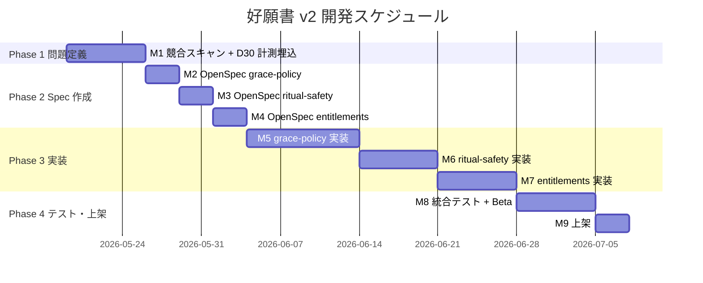

> 「好願書 v2」を題材に、PM × AI のワークフローが実際に最後まで回る道筋を分解する。

## 0. AI Native PM とは何か

ここ二年で一番よく聞くキャリア不安の第一位は「AI は PM を置き換えるのか」だ。私の観察は逆だ ── **AI に合わせてワークフローを組み直せる PM が、組み直せない PM を置き換えつつある**。だからこそ「AI Native PM」という言葉が最近浮上してきている。

これは「ChatGPT で PRD を書ける PM」とは違う。AI Native PM の核心はこうだ：

- **すべての作業ノードが再設計されている**：source curation、市場調査、MRD / PRD、issue 分解、prototype、UIUX レビュー、テスト、ドキュメント同期 ── 各セグメントに対応する AI ツールがあり、「従来の流れの一部だけを AI で加速する」ではない
- **AI を Agent として使う、検索エンジンではなく**：「挑戦者」の役割を与えれば、AI は逆に質問してきて仮説を揺さぶる；「N 通りの実装路線を trade-off 付きで挙げて」と頼めば、実装路線を発散してくれる ── これは sub-agent が動いている、チャットではない
- **PM の時間が「実行」から「判断」へ戻る**：従来 PM は 80% の時間を文書生成、進捗追跡、要件翻訳に使っていた。それを Agent が片付けると、PM が本当にやるべきは**境界、優先度、判読** ── 人間にしかできない部分が残る

この記事では、自分で作った「好願書 v2」（心経の念誦記録アプリ）を題材に、Agentic Workflow を一通り走らせる。**ただし最大のポイントは「どの skill を使ったか」ではなく、「AI のどこを修正したか」だ** ── そこは第 5 節にある。先に飛んでもいい。

<!-- more -->

## 1. 出発点：v1 の痛み点と N=1 問題

「好願書」は自分のために作ったアプリだ。毎日心経を唱えるが、今日何回唱えたか、先月どこまで続いたかをよく忘れる。App Store の念誦カウンタはどれも UI が 90 年代風に古いか、アカウント・SNS・広告で複雑すぎるか、なので v1 を自作した。

v1 が解決した痛み点は単純だ：

- **念誦カウント**：±1 ボタン + 木魚効果音
- **発願計画**：「家族のために 108 回 × 49 日」のような目標付き念誦を設定可能
- **ローカル永続化**：AsyncStorage、アプリ再起動後も進捗が消えない
- **禅意 UI**：宣紙ベージュ、Noto Serif TC、広告なし

技術スタックはクリーン：Expo SDK 54、React Native、TypeScript、Zustand。9 画面、すべてローカルファースト。

問題は ── **v1 は自分の痛み点を解決しただけ、N=1 に過ぎない**。v2 に育てるには、本格的な PM 仕事が始まる。

ここから v2 の完全なフローを 4 つの Phase に分けて紹介する。まず全体図から：


**Phase 2 がこのフローの心臓**であり、この記事で読む価値があるのもそこだ。他の Phase はツールを差し替えても動くが、Phase 2 の人間の判断は外部委託できない。

---

# Phase 1 · 正しい問題を見つける

## 2. Step 1：Claude で source curation（NotebookLM ではなく）

PM が最初に犯すミスは、感覚で機能を足すことだ。「共同念誦サークルを追加しよう」── これは founder mode であって PM mode ではない。

PM が次に犯すミスは、**Google で適当に集めた source を一括で NotebookLM に投げ込むこと**だ。違いはこうなる：


NotebookLM は「読んで引用する」能力が極めて強いツールだが、どの source が読む価値があるかは判断してくれない。20 本の記事を投げ、そのうち 5 本がコンテンツファーム、3 本が古く、2 本がトピックに無関係でも、NotebookLM は誠実にそれらを引用し、見かけ上は緻密な結論を出してくる。**Garbage in, citation out.**

だから NotebookLM の前に、Claude による source curation の層を一つ入れる。

**Claude に渡した brief（簡略版）：**

> 「好願書」アプリの v2 を企画している。ローカルファースト、データ収集なし、仏教念誦の記録。以下を探してほしい：
> 1. グローバル＆中華圏のスピリチュアル・ウェルネス / mindfulness アプリの市場規模、CAGR、マネタイズ動向
> 2. 競合（佛號計數器、Insight Timer、Calm、Headspace、Habit Tracker 系）の機能とレビュー
> 3. 行動心理学：「習慣の中断後の放棄」「streak 設計」に関する研究と批評記事
> 4. 「ハイブリッド・セイクリッド」「デジタル儀礼」に関する最近の議論
>
> 各エントリには：タイトル、URL、source 種別（学術論文 / 業界レポート / レビュー / App Store ページ）、なぜ読む価値があるかを添えてくれ。

**Claude の初版は 35 件**だった。私が自分で振り落としたのは：
- SEO コンテンツファーム風の「スピリチュアルアプリおすすめ」記事 2 本
- 2019 年以前の古いレポート 3 本（市場規模データが古い）
- 「瞑想 vs マインドフルネス」の純粋な哲学記事 1 本（v2 の判断に無関係）

最終的に 27 件が残り、NotebookLM に投入した。

### なぜ「Claude が探す → 人が篩う → NotebookLM が読む」3 段階で、2 段階ではないのか

| ステージ | AI に任せるか | 理由 |
|---|---|---|
| source を探す | ✅ Claude | WebSearch を走らせ、タイトルからトピックを判断できる |
| source を篩う | ❌ 必ず人がやる | 「関連しているように見えるが実は使えない」かどうかは PM にしか分からない |
| source を読む | ✅ NotebookLM | 全文を読み切って原文を cite できる |

**フィルタリングの段階を省略すると、要約された情報が歪む** ── NotebookLM は誠実にダメな source、古いデータ、トピック外の記事も引用し、見かけ上は緻密な結論を返してくる。フィルタリングの責任は PM にしか置けない。

## 3. Step 2：NotebookLM に「挑戦者」プロンプトを与える

source curate が終わったら NotebookLM に進む。**ただし、ここで本当の PM 仕事は prompt 設計だ。**

一般的な人が書くプロンプト：

> これらの source を分析して、v2 が何をやるべきかをまとめて。

このプロンプトの問題は ── NotebookLM が**あなたに同意することに全力を尽くす**ことだ：「source A によれば同期機能を追加するべき、source B によれば SNS 機能を追加するべき、source C によれば……」 一見充実しているが、実は手抜きのレポートが返ってくる。


**私が使ったプロンプトは逆 ── 「挑戦者」の役割を与える**：

```
あなたは厳格な市場調査アナリストです。iOS アプリ「好願書」
（念誦記録アプリ）に関する市場分析レポートを審査しています。

私は二種類の sources をアップロードしました：
1. 既存の市場分析レポート（タイトルに「好願書 · 市場需求分析報告」を含む）
2. 競合 App Store ページ 8 件と評論記事 4 件

あなたの役割：

支持者ではなく、挑戦者です。あなたの仕事はこのレポートに同意することではなく、
sources の証拠を使って：

- どの結論が立つかを検証する（どの source のどの段落が証拠かを指摘）
- どの結論が証拠薄弱または誤りかを反駁する
- 抜けている視点・競合・痛み点を補強する

回答原則：

- すべての結論は具体的な source を引用すること（NotebookLM が自動でラベル化）
- sources に証拠がない場合は「sources 中に該当情報なし」と明示し、
  訓練データに頼らないこと
- 繁体字中国語で回答
- 構造化出力：先に結論、後に証拠

タスク開始：

まず「全体評価」を一段落で：このレポートの全体的な信頼性は（高 / 中 / 低）？
最も強い論点 3 つ？最も弱い論点 3 つ？追加で読むべき sources のカテゴリ 3 つ？

全体評価を完了したら、私が個別の話題で深掘りしていく。
```

このプロンプトは 5 回書き直した。毎回、強化していたのは一つだけ：**AI に訓練データで補わせないこと**。

### なぜこの設計

| 設計上の選択 | 理由 |
|---|---|
| 「挑戦者であって支持者ではない」 | LLM のデフォルトは同意。明示的に反対の役を割り当てて初めて弱点を突く |
| 「sources にない場合は『該当情報なし』と明示」 | 訓練データの密輸を阻止 |
| 「先に全体評価を出す」 | 意見を先に出させる。後ろから深掘り。1 万字の総括を防ぐ |
| 「結論は source の段落を引用」 | NotebookLM の中核優位を強制使用 |
| 「最強 / 最弱を各 3 つ」 | 定量化を要求すると順位付けが強制される。出力が「並列リスト」から「優先順位のついた判断」に変わる |

一巡走ったところで、NotebookLM が返した 2 つの結論が v2 の方向を決めた：

**結論 1**：グローバル・スピリチュアル・ウェルネスアプリ市場は 2025 年で USD 23.8–25.6 億、CAGR 14.2–16.6% だが、「subscription fatigue」が既に顕在化。**一回買い切りか B2B が出口。**

**結論 2**：streak 連続記録に依存すると「what-the-hell effect」が誘発される、**1 日逃すと完全放棄する確率が 63% 高まる**（《Journal of Personality and Social Psychology》2020）。佛號計數器系アプリが圧倒的市場占有率（2,364 件のレビュー、4.8 つ星）を持つのは、「**儀礼の安全性 > UI/UX の慣習**」によるもの ── 誤タップを避けるため、「マイナス」「クリア」キーを主画面に置かない設計。

この 2 つの結論は地味に見えるが、それぞれが v2 の二つの袋小路（サブスクリプション、streak gamification）を殺した。

---

# Phase 2 · 実行可能なドキュメントを書く

## 4. Step 3：Claude Code で MRD + PRD を生成

調査結論が手に入った。次のステップは**コードを書きに行くこと**でもなく、Obsidian で頭の中を吐き出すことでもない ── まず MRD と PRD を作る。

このステップで生成される 2 つの文書は、PM ワークフローで省略できないものだ。市場ポジショニング、目標 KPI、scope 境界 ── これらをエンジニアリングに入る前に合意しておく。整体ワークフローにおける位置はこう：


### なぜ MRD と PRD の 2 つに分けるのか

| 文書 | どの問いに答える？ | 誰が読む？ |
|---|---|---|
| **MRD**（Market Requirements Document） | 誰のどんな問題を解決するか？市場機会はどこか？KPI は何か？ | 経営層、未来の投資家、未来の自分 |
| **PRD**（Product Requirements Document） | その MRD に対して、製品は具体的に何をやるか？user story、AC、scope、マイルストーン | エンジニアリング、デザイン、QA |

これを 1 つの「要件書」に混ぜる人が多い ── 商業仮説と受け入れ条件が混在し、PRD を読むエンジニアは「なぜこの user story が重要か」が分からず、MRD を読むビジネスサイドは技術的詳細に溺れる。

**分けることの最大のメリット**：MRD の変更は戦略議論を、PRD の変更はエンジニアリング工数見積もりを発火する。2 つの議論が干渉しなくなる。

### MRD の章立て（社内開発参考用）

```
1. 文書目的
1.1 用語定義
2. 市場機会（グローバル / 台湾 / 後続展開）
3. ターゲットユーザー（3 つの Persona）
4. キー市場洞察（4 項目）
5. 競合分析
6. ビジネス・ポジショニング
7. v2 ビジネス目標と北極星指標
8. リスクと仮説（要検証）
9. 確定事項記録
付録：データソース一覧
```

### PRD の章立て

```
1. 文書目的
1.1 用語定義（MRD と同期）
2. v2 ビジョン
3. v2 範囲（in / out scope）
4. ユーザーストーリーと要件（各 US に As / I want / So that / AC）
5. 非機能要件（性能 / プライバシー / 互換性 / i18n / アクセシビリティ）
6. 成功指標（PRD 受け入れ）
7. 推奨マイルストーン
8. リスクと依存
9. オープンクエスチョン（確定 / 未決）
付録 A：D30 測定方法の比較
```

### Claude Code に 2 つを生成させるコマンド

`Claude Code` でこのコマンドを叩く（簡略版）：

> 以下の 2 つの調査結論（NotebookLM の出力を貼る）と、`README.md`、`openspec/specs/` の既存 v1 スペックを組み合わせて、生成してくれ：
>
> 1. MRD（市場需求文書）、章立ては以下：[…]
> 2. PRD（製品需求文書）、章立ては以下：[…]
>
> 書き始める前に、3 つの重要分岐（マネタイズ範囲、grace mechanism の深さ、儀礼安全性の厳格さ）を会話で先に確認してくれ。書き終わったら Notion の「好願書 App Spec」ハブページの下に同期しろ。

肝は「**書き始める前に 3 つの重要分岐を会話で確認**」だ ── このコマンドのおかげで、Claude はいきなり「あなたが買わない文書」を生成せず、`AskUserQuestion` で scope を双方向に確認しながら進める。各分岐の選択肢は文末のスクリーンショットに掲載する。

最終的に出力された 2 つの Notion ドキュメントは合計約 5,000 字、12 個のテーブルを含む。

**しかしこの文書はまだ 80% しか正しくない。** 残り 20% は Step 4 で私が修正したこと ── この記事全体で一番重要な節だ。

## 5. Step 4：人機対照 ── AI のどこを修正したか

> この節がこの記事の核心。もし時間がなければ他の章を飛ばしてもいい、この節だけは読み切ってほしい。

**AI は自分が知らないことを能動的に認めない**。流暢な口調で見かけ上完璧な文書を書くが、その中に事実誤認、概念の混同、結論を装った placeholder が紛れている。PM の価値はちょうどこの 20% にある ── それらを見つけ、追及し、修正することだ。

以下、Claude と MRD/PRD を作る過程で**実際に起きた** 5 つの修正ケース。

### 修正ケース概要

| # | AI が最初に書いた | 私が出した問い | 修正後 | PM 思考の表れ |
|---|---|---|---|---|
| 1 | 「**streak を削除すれば** D30 リテンションが上がる」 | 「v1 に本当に streak はあるのか？」 | v1 は元から streak を採用していなかった；v2 は grace mechanism を「追加」するだけ | 事実核対 |
| 2 | 「63% 放棄率（NotebookLM 研究結論）」 | 「63% の根拠は何？」 | MindSpaceX の記事 + JPSP 2020 年論文を追加 | 出典管理 |
| 3 | 「30 日後の中断・放棄」という用語を混用 | 「中断は 30 日使わないこと？」 | 用語定義表を追加：中断 = 1 日抜け、放棄 = D30 戻らず | 意味の精確化 |
| 4 | 「D30 測定 解法 B：自前 anonymous aggregate endpoint」を業界用語で説明 | 「ユーザーがデータをアップロードしていないのに、どうやって D30 で戻ったか分かる？」 | 完全なシナリオ説明を追加、「念誦データは送らない」vs「最小イベントだけ送る」を区別 | 平易な説明の要求 |
| 5 | データソースをすべて「NotebookLM 研究結論」と書く | 「これ、出典をどこで調べればいい？」 | 4 つの具体的なソース、Notion リンク、参照経路を追加 | 文書の使用可能性 |

以下、最も教育的な 3 つを展開する（**ストーリーの完成度順、上表の通し番号と必ずしも対応しない**）。

### ケース 1：「v1 に本当に streak はあるのか？」

**AI が書いた**：
> 仮説 1：**streak を削除すれば**、ユーザーの長期リテンションが向上する

**あなたが問うた**：「v1 に streak はあるの？」

**真相**：`grep -rn "streak" src/` をかけても一つも見つからない。v1 は streak を実装したことがなく、v2 でもやらない ── 削除するものがないので、この仮説は論理的に成立しない。

**修正**：仮説を全部書き換えて「v2 で新規追加する grace mechanism（一時停止、二日ルール、自動延長）は、中断後に放棄しようとするユーザーを引き戻し、D30 リテンションを向上させる」とした。元の仮説は丸ごと削除。

**PM 思考**：AI の文章が流暢なときほど、事実核対をすっ飛ばしやすい。「v1 に streak はあるか？」は `grep` 一発で確認できることだが、それを問うのは PM だけだ ── PM だけが「本当に何を変えているか」に関心を持つから。

### ケース 2：「63% はどこから来た？」

**AI が書いた**：
> 63% 放棄率、出典：NotebookLM 研究結論

**あなたが問うた**：「63% の根拠は何？」

**真相**：AI（私）も知らなかった ── これはあなたが渡してくれた NotebookLM 結論の言い換えに過ぎなかった。そしてあなたは最も PM らしい動作をした ── NotebookLM に戻って source を漁り、元の出典を掘り起こした：《How to Recover from Habit Streaks Breaking》（MindSpaceX）が《Journal of Personality and Social Psychology》2020 年の研究を引用。

**修正**：MRD §1.1 の出典欄を具体的なジャーナルに更新；「付録：データソース一覧」テーブルを新設。文書全体の引用が「NotebookLM 研究結論」から具体的な出典に置き換わり、将来の検証経路ができた。

**PM 思考**：`TODO: 出典を追加` は文書で最もよくある腐敗ポイント ── 3 ヶ月後に誰も補完を覚えていない。優れた PM は TODO がまだ新鮮なうちに追い詰める。

### ケース 3：「中断は 30 日使わないこと？」

**AI が書いた**：
> grace mechanism が、研究で示された 63% 放棄率（中断後の放棄行動）を本当に解決するかを直接検証する。

**あなたが問うた**：「中断は 30 日使わないこと？」

**真相**：「中断」という言葉を AI（私）は曖昧に使っていた。研究原文の「中断」は「1 日抜けると what-the-hell effect を誘発」だが、v2 エンジニアリング上の「放棄」の操作定義は「30 日アプリを開かない」だ。**まったく違うスケールの話**なのに、両方を「中断」一語で済ませていた ── 読者は 1 日のことなのか 30 日のことなのか区別できない。

**修正**：MRD と PRD に同期して「§1.1 用語定義」表を新設し、4 つの語を明確に区別：
- **中断**（漏れ）：「日」単位、当日の目標未達なら 1 日分の中断
- **連続中断**：N 日連続で +1 の記録なし
- **放棄**（離脱）：最後に開いてから 30 日以上利用記録なし
- **D30 retention**：インストール後 30 日目当日にもアプリを開いたユーザー比率

**PM 思考**：曖昧な語ほど文書の中で増殖しやすい ── 読者各自が定義を補い、KPI 受け入れの段階で「みんなが考えていたことが違った」と気づく。良い PM は、一つの語が章をまたいで現れたら「これらは同じことを指しているか？」と尋ねる。

### 80/20 の法則

5 巡の修正を経て、一つの観察にまとまった：

> **AI が生成する PRD/MRD は約 80% 正しい。残り 20% には：事実誤認、結論を装った placeholder、概念の混同、出典の欠落、用語の衝突が含まれる。**
>
> その 20% こそが PM のこのワークフローでの価値だ。PM が「生成」ボタンを押して commit するだけなら、AI は本当にその人を置き換える。PM が 20% を直すなら、AI は永久に増幅器になる。


その 20% は自然には浮上しない ── PM が能動的に「v1 に streak はあるのか？」「63% はどこから？」「中断は 30 日使わないこと？」と問わない限り発見できない。

この節を記事の真ん中に置いた理由は、**「AI Native PM」と「AI オペレーター」を分ける線がここにある**からだ。前者は 5 巡の修正を経て文書を納品する；後者は 80 点の、しかし事実誤認のある文書を納品する。

---

# Phase 3 · エンジニアリングへ落とし込む

## 6. Step 5：PRD → エンジニアリング納品（ガントチャート + Issue の 2 トラック）

PRD ができた。次にこれを「2 種類の読者」に渡す：

- **ステークホルダー / 自分**：全体のスケジュールを見たい、いつ上架できるかを知りたい → **ガントチャート**
- **エンジニアリング（自分 + Claude Code）**：各タスクで何をするか、AC は何かを見たい → **Issue 分解**

この 2 つの成果物は**互換ではない**。違う対象に違う問題を解決するものだ。「どちらか一方」と二者択一を提唱する PM 記事をよく見るが、実務では 2 トラックを並走させる。

### ガントチャート：スケジュール視点

PRD §7 にはマイルストーン表（M1–M9）が既にあるが、表だと視覚的に弱い。Claude に Mermaid Gantt に変換させる：



ガントチャートの役割は **非エンジニア（自分、ステークホルダー、将来の協業者）に全体を一目で見せること**。8 週で上架できるか、クリティカルパスはどの週か、テストの時間が足りているか ── マイルストーン表は加算が要るが、ガントチャートは一秒で分かる。

しかし **ガントチャートはエンジニアリング納品物ではない** ── エンジニアはガントチャートに対してコードを commit しない、必要なのは issue だ。

### Issue 分解：エンジニアリングが受け取る視点

Claude の本当の力はここで発揮される：**PRD §4 の各 user story を、GitHub Issues / Linear にそのまま貼り付けられる形式に分解する**。

PRD US-G1（一時停止）を例に、Claude が分解した issue：

```markdown
## Title
feat(plan): 計画の一時停止メカニズム

## 背景
PRD §4.1 US-G1。病気や出張で計画を中断した後の完全放棄を防ぐため、
「休養 / 一時停止」ボタンを追加。停止中は中断にカウントせず、
リマインダー通知も発火させない。

## AC 受け入れ条件
- [ ] 計画詳細画面に「休養 / 一時停止」ボタン
- [ ] 一時停止は 1–14 日または「指定なし（手動復帰）」を設定可
- [ ] 停止中はホームカードに「休養中 · 残り N 日」ラベル
- [ ] 停止中は中断カウントなし、リマインダー通知なし
- [ ] 停止期間終了時に自動復帰；手動モードは任意のタイミングで「復帰」可
- [ ] Plan データモデルに pausedFrom / pausedTo フィールドを追加
- [ ] 既存計画の migration：pausedFrom = null

## 依存
なし

## 工数
1.5 日

## Labels
capability/grace-policy, priority/P0, area/plan
```

ガントチャートの「一時停止 · 1.5 日」は「**いつやるか**」の答え、issue は「**何をやるか**」の答え。両方が必要。

### Claude Code に両方を一度に生成させるコマンド

```
openspec/specs/plan-management/spec.md と Notion PRD §4 + §7 を読み、2 つやってくれ：

1. Mermaid Gantt を生成：PRD §7 のマイルストーンを基準に、
   8 週の開発スケジュール図を docs/v2-gantt.md に保存
2. 各 user story について、docs/issues/ に issue.md ドラフトを生成。
   各 issue に：title、背景（PRD リンク付き）、AC、依存、工数、labels

直接 gh issue create はしないこと ── 先にレビューさせてくれ。
```

最後の行が肝：**先にレビューさせて**。AI は 80% を取れるが、残り 20%（どの issue を統合するか、どれを分割するか、依存関係が正しいか、ガントチャートの工数が現実的か）はやはり PM が見る。

## 7. Step 6：境界を固定 ── openspec change proposal

issue 分解の前に、各 capability の spec delta を [openspec](https://github.com/Fission-AI/openspec) で固定する。

openspec は軽量な仕様プロセス、3 セクションで構成：

```markdown
## Why
v1 はローカル念誦記録の体験を完成させたが、ユーザーは中断後に完全放棄しやすい
（JPSP 2020 の研究で 63% 放棄率）。v2 は grace mechanism と儀礼安全性を補い、
製品の境界を広げない。

## What Changes
- 新規 `grace-policy` capability：一時停止、二日ルール、自動延長
- `woodfish-counter` の修正：-1 を長押しに、没入モードでは -1 を削除、階層的 haptics
- `settings` の修正：データ削除を typing confirmation に
- 新規 `entitlements` capability：feature flag 抽象層（v2 では決済を繋がない）

## Out of scope
- サブスクリプション、実際の IAP、paywall
- クラウド同期、アカウントシステム（iCloud 含む、v3 へ）
- SNS、streak、AI による経典解釈、B2B
```

**Out of scope は What Changes よりも重要**。PM がエンジニア、デザイナー、将来の自分に対して引く境界線だ。これがないと、3 ヶ月後に必ず誰かが「ついでにシェアボタンも入れない？」と言ってくる。

Why と What は Claude にドラフトさせてもいいが、**Out of scope は人間が書かないといけない** ── AI はどれが触ると爆発するかを知らない。

## 8. Step 7：Claude Code で Prototype + Code Review

spec が固まったら、最後の段がエンジニアリングの仕事 ── そのエンジニアは Claude Code でいい。

openspec の良さは `tasks.md` を強制的に書かせること。Claude Code は `proposal.md + design.md + tasks.md` を受け取り、**タスクを順に消化しながらコードを書く**。spec に対して走るので、勝手に API を発明したり、既存の store 構造を改変したりしない。

私がやるのは二つ：**code review** と **spec への対照**。

**Code review**：task block を一つ終わるごとに commit、commit message に task 番号を入れる（`feat(grace): 1.1 add pausedFrom/pausedTo to Plan`）。

**Spec への対照**：初版はほぼ確実に spec から外れる。AI はあなたの設計を「最適化」しようとする ── toggle 追加、進捗バー追加、「今すぐ同期」ボタン追加 ── どれも親切に見えて、どれも scope creep。PRD AC を逐一対照する：

- ✅ 一時停止 1–14 日設定 → ある
- ✅ 「休養中 · 残り N 日」ラベル → ある
- ❌ AI が追加した「停止を強制終了」赤ボタン → spec にない、「休養」のテイストと衝突、削除
- ❌ AI がラベル色に `#FF6B6B` 警告オレンジを使用 → アプリ全体は低彩度、token `colors.zen.moss` に修正

**AI が出す画面は 80% spec に合っている。残り 20% は AI が見ていない大域的な制約**（既存 utils、既存デザイン言語の慣例、製品の調性）。その 20% は PM が守るものだ。

## 9. Step 8:Playwright で自律テスト

UIUX 揃えが終わったら、次は **Claude Code に自分で受け入れさせる**。

このワークフローにおける Playwright の役割は「QA エンジニアが書く E2E テスト」ではなく、**Agent に目を与えること** ── Claude Code が自分で flow を走らせ、自分でスクリーンショットを取り、期待動作と照らし合わせ、差異を見つけたら自分で戻って直す。

Claude Code に投げる命令：

> PRD §4.1 US-G1（一時停止）の受け入れを実施せよ。
>
> 1. simulator を起動
> 2. Playwright で「計画進入 → 一時停止タップ → 3 日設定 → 確認 → ホーム戻りラベル確認」flow を走らせる
> 3. 各ステップを `screenshots/grace-pause/` にスクショ
> 4. PRD AC と逐一照合し、差異を明示
> 5. 差異があれば、コードを直してもう一度走らせる

肝は「**任意の段階に挿入できる**」 ── 全タスクが終わってからテストするわけではない。user story が一つ終わるごとに Playwright を 1 巡走らせる、AI 自身が問題を見つけて自分で直す、simulator を手で押す時間を大幅に節約できる。

## 10. Step 9:Figma / Pencil でデザイン稿往復（オプション）

デザイナーがいる、または prototype をデザインツールに戻して仕上げたい場合、**Figma** または **Pencil** に接続する。

**Figma vs. Pencil の比較：**

| 軸 | Figma | Pencil |
|---|---|---|
| **AI 連携方式** | Plugin 経路 | ネイティブ MCP server |
| **ファイル保存** | クラウド中心 | 暗号化 `.pen` ファイル、ローカル |
| **コラボレーション** | リアルタイム複数人編集、業界標準 | 個人中心 |
| **AI 操作精度** | plugin で node を翻訳しないと読めない | Claude Code が直接 read / edit / snapshot |
| **適合シナリオ** | デザイナーがいるチーム、デザイン引き渡しが必要 | 個人 + Agent ワークフロー、プライバシー重視 |

好願書のような「**一人 + AI Agent + ローカルファースト**」プロジェクトでは Pencil を選んだ ── Claude Code が plugin なしで `.pen` ファイルを直接読み書きでき、全体のチェーンが agentic context を離れない。

この節は**オプション**だ ── 好願書 v2 のほとんどの screen は、Claude Code が Pencil MCP で一発で終わる；視覚比重の重い「新機能ホーム」だけ Pencil で比率を微調整する。

---

# Phase 4 · 人間に同期する

## 11. Step 10:Notion で人に共有

最後のステップ：MRD、PRD、決定記録、デザイン稿を Notion に上げる。

markdown を全コピペはしない ── それは開発リポジトリを single source とする利点を捨てることだ。私がやるのは：

- **結論性の文書だけ Notion に**：MRD、PRD、確定事項
- **GitHub にリンクで戻す**：`openspec/changes/2026-05-19-grace-policy/` が single source of truth
- **デザイン稿、スクリーンショット、決定記録は Notion に**、これらは git に入れると重い
- **データソースを明示**：Notion 内部ページは直接リンク、外部 NotebookLM source は参照経路を明記

Notion は「コードを書かない人」のための窓。git repo は「checkout できる人」のための拠り所。

Claude Code + Notion MCP で、PRD から Notion ページへの同期は一発 ── ただし**「何を載せて、何を載せないか」の判断は永遠に人間が下す**。MRD/PRD は選択的に同期するが、OpenSpec change proposal は git に残す。

---

## 人機協業の 3 層分担

総括テーブルに進む前に、このワークフローの「人機分担」を 3 層に抽象化する：


**上に行くほど外部委託できない**。第 5 節の 5 つの修正ケースが重要なのは、それらが L2（レビュー）と L3（判断）にまたがるからだ ── L1 の AI はそこに全く手が届かない。

## 総括：どこを AI に任せて、どこは人間にしかできないか

| ワークフローノード | ツール / Skill | AI に任せられる | AI に任せられない |
|---|---|---|---|
| **Source curation** | Claude WebSearch | ✅ 検索を走らせる、候補をリスト化、source 種別を付ける | ❌ どの source を NotebookLM に渡さないかの判断 |
| **市場調査** | NotebookLM | ✅ 全 source を読み、原文を cite、挑戦者 prompt を走らせる | ❌ 挑戦者 prompt の設計、結論の信頼度判読 |
| **MRD / PRD 作成** | Claude Code | ✅ 章立てドラフト、構造化出力、Notion 同期 | ❌ scope 境界、KPI 選択、用語の精確化 |
| **人機対照修正** | 脳 + コーヒー一杯 | — | ❌ **全部**。事実核対、出典追及、概念分解 |
| **PRD → Issue** | Claude Code | ✅ user story を issue 形式 + AC に分解 | ❌ どれを統合するか、依存をどう設定するか |
| **ガントチャート** | Mermaid | ✅ マイルストーン表を視覚化スケジュールに変換 | ❌ 工数が現実的か、ステークホルダーがどの切り口を見たいか |
| **境界の固定** | openspec | ✅ Why / What のドラフト | ❌ **Out of scope**。AI はどこを触ると爆発するか知らない |
| **コーディング** | Claude Code | ✅ tasks.md に沿って実装、commit | ❌ Code review、踏み外しの確認 |
| **自律テスト** | Playwright + Claude | ✅ flow を走らせ、スクショ、対照、自己修正 | ❌ どの flow を試すか、何を pass とするかの決定 |
| **デザイン稿往復** | Figma / Pencil | ✅ 視覚調整、Design System 適用 | ❌ 「往復すべきかどうか」の選択 |
| **Notion 同期** | Claude + Notion MCP | ✅ フォーマット変換、スクショ生成 | ❌ 何をどこに置くか、誰が見られるか |

---

## 結語：AI Native PM の本当の定義

この記事を書き終えて、自分の定義を校正し直した：

> **AI Native PM とは「すべてのノードで AI を使う PM」ではなく、「すべてのノードで AI がどこで間違えるかを知っている PM」だ。**

第 5 節の 5 つの修正ケースがこの定義の証拠だ。AI が出した MRD/PRD だけ見ると、よく書けているように見える。しかし「v1 に本当に streak はあるのか？」「63% はどこから？」「中断は 30 日使わないこと？」と一言問うた瞬間、AI の 80% の流暢さは 20% の真実にぶつかる。

その 20% が PM の価値であり、この仕事が AI に置き換えられない核心だ。

### なぜこの flow の第 1 ステップに NotebookLM を頑なに使うのか

記事全体を読むと、最前段の Step 1 + Step 2 が一番単純で省略されやすい ──「資料を探して分析するだけでしょ？ ChatGPT に投げればいいじゃない？」

しかし私が NotebookLM にこだわるのは、UI が綺麗だからではなく、その**設計上の制約**ゆえだ：

- **与えた source しか使わない** ── 訓練データで隙間を埋めない
- **すべての結論にどの段落を cite しているかが付く** ── 原文に遡れる
- **見たことがないものは「sources 中に該当情報なし」と素直に言う**

言い換えると、NotebookLM は **AI 幻覚リスクを下げるツール**で、その代償は PM が事前に source curation（Step 1）を済ませること。単一 LLM に「市場を分析して」と投げる方が早いが、得られるのは流暢な訓練データのコラージュであって、追跡可能な調査結論ではない ── その結論が MRD の市場規模、競合データ、心理学引用を支えるとき、**追跡可能性は妥協できない**。

このツール選択のロジックは、記事全体の主軸と一致している：**良い PM は最強の AI を使うのではなく、適切な AI を使い、その AI の制約が浮上させる責任を引き受ける**。

### 最後の一言

ツールは速く走らせてくれるが、**どこへ行くか、いつ立ち止まって問い直すか、どれを「AI が知っているはず」と仮定してはいけないか ── これらは依然として人間にしかできない**。

---

## 付録：好願書 v2 ドキュメント所在

- MRD：[Notion ページ](https://www.notion.so/364fac1cd710814cb08ec2fa9b431196)
- PRD：[Notion ページ](https://www.notion.so/364fac1cd71081efafb1f6f9db25cf0a)
- 市場需求分析レポート：[Notion](https://www.notion.so/362fac1cd7108134bd8ee70f50fca4a7)
